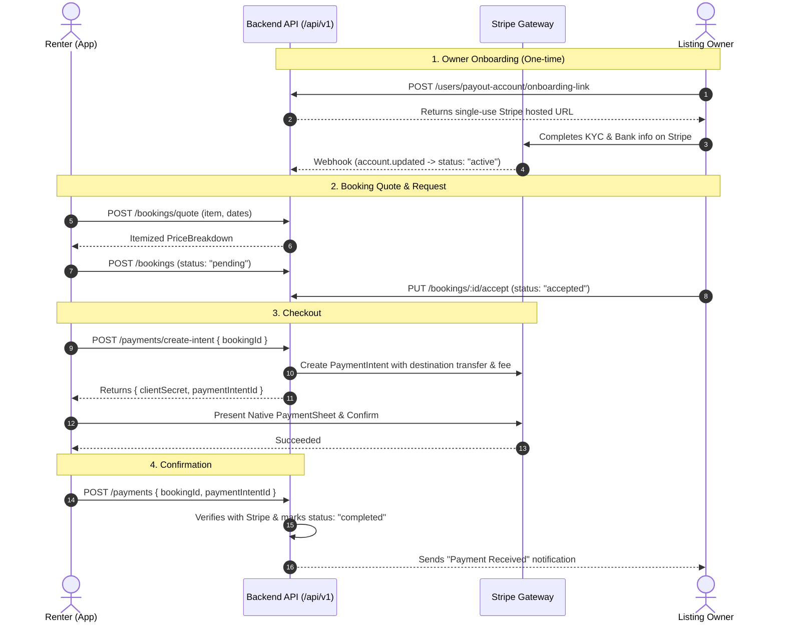

# Payments & Stripe Connect — App Developer Guide

Everything a mobile (Flutter / React Native) and web client needs to integrate the Atussa payment flow: itemized pricing quotes, owner payout onboarding (Stripe Connect Express), card checkout via Stripe PaymentSheet, webhook reconciliation, and transaction history.

- **API Base:** `https://au2p3vkiqi.us-east-1.awsapprunner.com/api/v1`
- **Auth:** Standard `Authorization: Bearer <accessToken>` header on all requests
- **Currency:** `CAD` (all financial arithmetic is in CAD)
- **Stripe Test Publishable Key:** `pk_test_51UKv9eR3j2YweSF38Q8c...` *(contact lead/check dashboard for team key)*
- **Swagger Documentation:** `/api-docs` ("Payments" and "User" tags)

---

## 1. High-Level Architecture

Atussa operates a peer-to-peer rental marketplace using **Stripe Connect Express destination charges**:

1. **Owner Side (Payouts)**: Owners connect their bank accounts via Stripe-hosted Express onboarding. No sensitive banking details (institution numbers, account numbers, KYC docs) ever reach or reside in our database.
2. **Renter Side (Charges)**: Renters pay with Card, Apple Pay, or Google Pay via Stripe's native Mobile PaymentSheet.
3. **Split Routing**: When a renter pays, Stripe automatically:
   * Transfers the owner's share (`ownerPayout.amount`) straight to the owner's connected Stripe account.
   * Retains the platform cut + sales tax (`application_fee_amount`) in the Atussa platform balance.



---

## 2. The Pricing & Fee Invariant

Before charging, always display the exact itemized breakdown from `POST /bookings/quote`.

| Side | Item | Rule |
|---|---|---|
| **Renter** | **Rental Base** | `dailyRate * totalDays - discount` |
| **Renter** | **Atussa Fee** | **3%** of rental base (minimum **$3.99**) |
| **Renter** | **Taxes on Fee** | Quebec taxes: **TPS 5%** + **TVQ 9.975%** on the Atussa Fee |
| **Renter** | **Delivery Fee** | 100% pass-through from listing |
| **Renter** | **Security Deposit** | **$0** (no security deposit is collected) |
| **Owner** | **Commission** | **15%** of rental base |
| **Owner** | **Taxes on Comm.** | **TPS 5%** + **TVQ 9.975%** on the commission (remitted by Atussa) |
| **Owner** | **Net Payout** | `Rental Base - Commission - Taxes on Comm. + Delivery Fee` |

> **Exact Invariant:**
> `totalAmount (renter pays) == ownerPayout.amount + platform.revenue + platform.taxCollected`

---

## 3. Phase 1: Owner Stripe Onboarding

Owners must set up payouts before renters can pay for their listings.

### Step 1.1: Check Owner Payout Status
```http
GET /users/payout-account
Authorization: Bearer <accessToken>
```

**Response (`200 OK`):**
```json
{
  "success": true,
  "data": {
    "state": "not_connected", // "not_connected" | "pending" | "restricted" | "active"
    "connected": false,
    "payoutsEnabled": false,
    "chargesEnabled": false,
    "detailsSubmitted": false,
    "requirementsDue": ["external_account"],
    "actionRequired": true,
    "bank": {
      "last4": "6789",
      "name": "STRIPE TEST BANK"
    }
  }
}
```

* **UI Rule**: If `state !== "active"` or `actionRequired === true`, show a banner/button: `"Set up Payout Account"`.

### Step 1.2: Get Onboarding Link
When the owner taps `"Set up Payout Account"`, fetch a fresh link:
```http
POST /users/payout-account/onboarding-link
Authorization: Bearer <accessToken>
```

**Response (`200 OK`):**
```json
{
  "success": true,
  "data": {
    "url": "https://connect.stripe.com/setup/s/acct_123/...",
    "expiresAt": "2026-10-02T16:30:00.000Z",
    "accountId": "acct_123456789"
  }
}
```

* **Client Action**: Open `data.url` in an in-app browser (`url_launcher` in Flutter, `InAppBrowser` in React Native).
* **Coming back**: Stripe only redirects to **http(s)** — a custom scheme is rejected outright — so it returns the owner to `/payouts/return` (or `/payouts/refresh` if the link expired) on this server, and that page immediately redirects to `APP_PAYOUT_RETURN_DEEPLINK` (`atussa://payouts/done`). Register that scheme in the app and the owner lands straight back in it; if the redirect is blocked the page explains what to do, so nothing breaks.
* **Always re-check on resume**: `returnsTo` is `"web"` whenever Stripe lands on the server page first, which is the normal case. Treat it as a hint, not a guarantee — call `GET /users/payout-account` both on the deep link *and* when the app next comes to the foreground.

---

## 4. Phase 2: Booking Quote & Acceptance

### Step 2.1: Price Breakdown Quote
```http
POST /bookings/quote
Authorization: Bearer <accessToken>
Content-Type: application/json

{
  "itemId": "64f1a2b3c4d5e6f7a8b9c0d1",
  "startDate": "2026-10-10",
  "endDate": "2026-10-15",
  "deliveryFee": 10.00
}
```

**Response (`200 OK`):**
Use `data.pricing.totalAmount` for display on the confirmation button, and display `data.atussaFeeExplainer` next to the Atussa fee line.

### Step 2.2: Booking Request & Acceptance
1. Renter calls `POST /bookings` with `itemId`, `startDate`, `endDate`, `deliveryType`. The booking is created with `status: "pending"`.
2. Owner receives notification and calls `PUT /bookings/:id/accept`. The booking becomes `status: "accepted"`.
3. **Payment is only permitted once the booking is `"accepted"`.**

---

## 5. Phase 3: Renter Checkout Flow

### Step 3.1: Create PaymentIntent on Backend
When the renter clicks `"Pay Now"` on an accepted booking:
```http
POST /payments/create-intent
Authorization: Bearer <accessToken>
Content-Type: application/json

{
  "bookingId": "651234abcd5678ef90123456"
}
```

**Response (`201 Created`):**
```json
{
  "success": true,
  "message": "Payment intent created successfully",
  "data": {
    "clientSecret": "pi_3MtwxAEomAQGuqc50mDuErSm_secret_Yr5a...",
    "paymentIntentId": "pi_3MtwxAEomAQGuqc50mDuErSm",
    "amount": 104.59,
    "currency": "CAD",
    "bookingId": "651234abcd5678ef90123456"
  }
}
```

### Step 3.2: Present Stripe PaymentSheet (Mobile)

#### Flutter Integration (`flutter_stripe`)

```dart
import 'package:flutter_stripe/flutter_stripe.dart';

Future<void> checkoutBooking(String bookingId) async {
  // 1. Call backend to get clientSecret
  final res = await api.post('/payments/create-intent', body: {'bookingId': bookingId});
  final clientSecret = res['data']['clientSecret'];
  final paymentIntentId = res['data']['paymentIntentId'];

  // 2. Initialize Payment Sheet
  await Stripe.instance.initPaymentSheet(
    paymentSheetParameters: SetupPaymentSheetParameters(
      paymentIntentClientSecret: clientSecret,
      merchantDisplayName: 'Atussa Rental Marketplace',
      applePay: const PaymentSheetApplePay(merchantCountryCode: 'CA'),
      googlePay: const PaymentSheetGooglePay(merchantCountryCode: 'CA', testEnv: true),
      style: ThemeMode.system,
    ),
  );

  // 3. Present Sheet to user
  try {
    await Stripe.instance.presentPaymentSheet();
    
    // 4. Confirm completion with Backend
    await api.post('/payments', body: {
      'bookingId': bookingId,
      'paymentIntentId': paymentIntentId,
    });

    showSuccessSnackBar('Rental booked and paid successfully!');
  } on StripeException catch (e) {
    if (e.error.code == FailureCode.Canceled) {
      // User dismissed payment sheet — no action needed
      return;
    }
    showErrorDialog('Payment failed: ${e.error.localizedMessage}');
  } catch (e) {
    showErrorDialog('Error completing payment: $e');
  }
}
```

#### React Native Integration (`@stripe/stripe-react-native`)

```tsx
import { useStripe } from '@stripe/stripe-react-native';

export function useCheckout() {
  const { initPaymentSheet, presentPaymentSheet } = useStripe();

  const payForBooking = async (bookingId: string) => {
    // 1. Fetch clientSecret
    const res = await api.post('/payments/create-intent', { bookingId });
    const { clientSecret, paymentIntentId } = res.data;

    // 2. Initialize Payment Sheet
    const { error: initError } = await initPaymentSheet({
      merchantDisplayName: 'Atussa Rental Marketplace',
      paymentIntentClientSecret: clientSecret,
      applePay: { merchantCountryCode: 'CA' },
      googlePay: { merchantCountryCode: 'CA', testEnv: true },
    });

    if (initError) throw new Error(initError.message);

    // 3. Present Sheet
    const { error: presentError } = await presentPaymentSheet();
    if (presentError) {
      if (presentError.code === 'Canceled') return;
      throw new Error(presentError.message);
    }

    // 4. Confirm with Backend
    await api.post('/payments', {
      bookingId,
      paymentIntentId,
    });
  };

  return { payForBooking };
}
```

---

## 6. Phase 4: Transactions History

Users can view outgoing payments (renter) or incoming rental earnings (owner).

### List My Transactions
```http
GET /payments/my?role=payer&page=1&limit=10
Authorization: Bearer <accessToken>
```

* `?role=payer`: Transactions where logged-in user paid (money out).
* `?role=payee`: Transactions where logged-in user was paid (rental income).
* `?role=all`: Combined ledger.

**Response (`200 OK`):**
```json
{
  "success": true,
  "data": [
    {
      "_id": "6701a2b3c4d5e6f7a8b9c0d2",
      "booking": {
        "_id": "651234abcd5678ef90123456",
        "startDate": "2026-10-10T00:00:00.000Z",
        "endDate": "2026-10-15T00:00:00.000Z"
      },
      "payer": { "_id": "...", "firstName": "Alice", "lastName": "Smith" },
      "payee": { "_id": "...", "firstName": "Bob", "lastName": "Owner" },
      "amount": 104.59,
      "currency": "CAD",
      "status": "completed",
      "method": "credit_card",
      "externalReference": "pi_3MtwxAEomAQGuqc50mDuErSm",
      "createdAt": "2026-10-02T16:15:00.000Z"
    }
  ],
  "pagination": {
    "page": 1,
    "limit": 10,
    "total": 1,
    "totalPages": 1
  }
}
```

---

## 7. Error Handling & Edge Cases

| HTTP Status | Message Scenario | User Message / App Action |
|---|---|---|
| `400 Bad Request` | `"Payment can only be recorded once the booking is accepted (this one is 'pending')"` | Show: *"Waiting for owner to accept booking before checkout can proceed."* |
| `400 Bad Request` | `"The listing owner has not connected their Stripe payout account yet..."` | Show: *"The owner is still completing their payout setup. Please notify them in chat."* |
| `400 Bad Request` | `"Stripe payment has not succeeded yet (status: 'requires_payment_method')"` | Card was declined or 3DS verification failed. Re-prompt user for a valid payment method. |
| `403 Forbidden` | `"Only the renter can pay for this booking"` | The logged-in account does not match the booking renter ID. |
| `404 Not Found` | `"Booking not found"` | Invalid or deleted booking ID. |
| `409 Conflict` | `"Payment already recorded for this booking"` | Payment is already complete. Prevent duplicate submission and redirect to the active booking details page. |
| `503 Unavailable` | `"Payment processing is not configured on this server yet"` | Server is missing Stripe configuration keys. |
